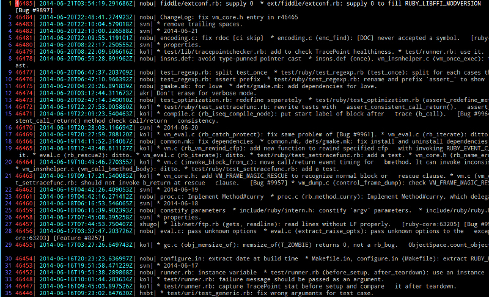

vimsvn.vim
==========

What is this?
------
svn client vim plugin.

Requirement
------
* vim with python support.
* svn command
* password caching system like gnome-keyring.
  * password input is currently not supported.

How to install
------

I recommned pathogen( https://github.com/tpope/vim-pathogen ) or similar plugins.
If you use pathogen you can install this plugin just type below.

        cd ~/.vim/bundle/
        git clone https://github.com/katonori/vimsvn.vim.git

How to use
------
* Type below to get the log list. Vim enters log view mode.

        :SvnGetLog

* Type below to confirm the status of the working copy. Vim enters status view mode.

        :SvnGeStat

Screen shots
------

* log view

* status view

Commands
------

### Log view

|Name            | Description |
|----------------|-------------------|
|SvnGetLog  | Show the change log list. Only the newest 200 logs are showed. If you want to see older logs use the command 'SvnGetLogNextRange'. Enter log view mode. |
|SvnGetLogNextRange | Get older logs |
|SvnGetLogPrevRange | Get newer logs |
|SvnGetChange | Show a change summary of a commit. Enter change summary view. |

### Change summary View

|Name            | Description |
|----------------|-------------------|
|SvnGetFileDiff | Show the difference from previous revision |

### Status view

|Name              | Description |
|----------------|-------------------|
|SvnGetStat | Show the currnet status of the working copy. Enter status view mode. |
|SvnGetFileDiff | Show the difference of the file under the cursor from base revision |
|SvnToggleCommit | Mark the item under the cursor to be committed. Marked items are committed by the command 'SvnCommitMarkedItems'|
|SvnCommitMarkedItems | Commit the items marked by the command 'SvnToggleCommit'|
|SvnAddFile | Add the item under the cursor to the repository. |
|SvnRevertFile | Rvert the item under the cursor. |

### For debug.

|Name              | Description |
|----------------|-------------------|
|SvnOpenLog | Show the execution log of this script and svn command |

Default key maps
------

### Log view

| Map          | Command            |
| ------------ | ------------------ |
|\<enter>   | SvnGetChange |
|\<c-n>  | SvnGetLogNextRange |
|\<c-p>  | SvnGetLogPrevRangea |

### Change summary view

| Map          | Command            |
| ------------ | ------------------ |
| \<enter>     | SvnGetFileDiff  |
|q      | Back to log view|

### Status view

| Map          | Command            |
| ------------ | ------------------ |
| \<enter> | SvnGetFileDiff |
| \<space> | SvnToggleCommit |

